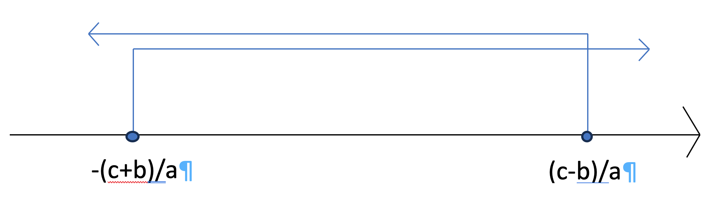

```{r setup, include=FALSE}
knitr::opts_chunk$set(echo = TRUE)
```
\justify


\newpage
\thispagestyle{empty}

\section*{Introducción}

\newpage
\thispagestyle{empty}

\section*{Sobre el curso de Cálculo Diferencial}

\subsection*{Información personal y redes sociales}
- [<code>Página personal</code>](https://directorioprofesores.uacm.edu.mx/profesor.html?key=2003080144) 
- [<code>Twitter</code>](https://twitter.com/carlosmroder) 
- [<code>Linkedin</code>](https://www.linkedin.com/in/carlos-martinez-r/)


{width=300px}

\newpage
\thispagestyle{empty}


\printindex

\newpage


\chapter*{Programa de Estudios de Cálculo Diferencial}


\section*{Propósitos generales: Al terminar el curso, el alumno:}
 
1.	Podrá plantear funciones, reales de variable real, a partir de modelos sencillos provenientes de otras disciplinas científicas o ingenieriles. Podrá decidir si son continuas o diferenciables, manejando con soltura los conceptos de continuidad, límites y derivada. 
 
2.	Conocerá y usará con soltura los métodos del cálculo diferencial, pudiendo derivar, con la definición al principio y luego con técnicas adecuadas, varios tipos de funciones: polinomiales, racionales, radicales, trigonométricas y composiciones de ellas. 
 
3.	Podrá graficar con precisión varios tipos de funciones, indicando puntos importantes en la gráfica incluyendo intervalos donde la función es monótona o tiene cierta concavidad. 
 
4.	Conocerá los conceptos de máximo y mínimo (local y global) de funciones definidas en intervalos de reales y podrá usar los criterios de la primera y segunda derivada para decidir si un punto dado es  máximo, mínimo o punto de inflexión de una función. 
 
5.	Podrá plantear y resolver problemas de optimización (máximos y mínimos) o razón de cambio partiendo de situaciones geométricas o de modelos provenientes de otras disciplinas. 
 
6.	Podrá usar algún tipo de programa de cómputo adecuado para graficar algunas funciones y visualizar aspectos geométricos de las mismas.  
 
7.	Podrá aproximar valores de funciones usando diferenciales y sabrá usar la regla de L’Hôpital para calcular límites indeterminados. 
 
 
 
\subsection*{Seriación: NO 	Asignaturas 	Previas: }
 
- Paralela: Álgebra y Geometría Analítica 

- Posteriores: Álgebra Lineal, Cálculo Integral, 
Cálculo Vectorial, Ecuaciones Diferenciales 
Ordinarias, Ecuaciones Diferenciales 
Parciales, Métodos Numéricos, Estadística  y Probabilidad. 
 

\subsection*{Requerimientos para cursar la asignatura }

**Conocimientos:** Dominio de factorización, operaciones y simplificación de expresiones algebráicas, Teorema de Pitágoras, resolución de sistemas de ecuaciones lineales de 2x2, resolución de ecuaciones lineales y cuadráticas, proporciones. 

**Habilidades:** abstracción (poder pasar de español al lenguaje simbólico y viceversa) y poder resolver problemas sencillos de álgebra utilizando los conocimientos arriba mencionados. 
 
**Perfil deseable del profesor:** Licenciatura o posgrado en Matemáticas o carreras afines (Matemáticas aplicadas, Física, Actuaría, Ingeniería). Que esté dispuesto a trabajar en la educación centrada en el aprendizaje de los alumnos. Que tenga experiencia docente y habilidad para conducir los procesos de aprendizaje. 
 
 
**Academia responsable del programa:** Matemáticas. 

**Elaborado por: ** Manuel Fernández Villanueva y José Juan Hernández. 
 
 

\section*{Temario de asignatura }

 
 
Nombre de la asignatura: Cálculo Diferencial. 
 
 
\subsection*{Objetivo(s) general(es) de la asignatura:}
 
Al terminar el curso, el alumno:  
 
1.	Podrá plantear funciones, reales de variable real, a partir de modelos sencillos provenientes de otras disciplinas científicas o ingenieriles. Podrá decidir si son continuas o diferenciables, manejando con soltura los conceptos de continuidad, límites y derivada. 
 
2.	Conocerá y usará con soltura los métodos del cálculo diferencial, pudiendo derivar, con la definición al principio y luego con técnicas adecuadas, varios tipos de funciones: polinomiales, racionales, radicales, trigonométricas y composiciones de ellas. 
 
3.	Podrá graficar con precisión varios tipos de funciones, indicando puntos importantes en la gráfica incluyendo intervalos donde la función es monótona o tiene cierta concavidad. 
 
4.	Conocerá los conceptos de máximo y mínimo (local y global) de funciones definidas en intervalos de reales y podrá usar los criterios de la primera y segunda derivada para decidir si un punto dado es  máximo, mínimo o punto de inflexión de una función. 
 
5.	Podrá plantear y resolver problemas de optimización (máximos y mínimos) o razón de cambio partiendo de situaciones geométricas o de modelos provenientes de otras disciplinas. 
 
6.	Podrá usar algún tipo de programa de cómputo adecuado para graficar algunas funciones y visualizar aspectos geométricos de las mismas.  
 
7.	Podrá aproximar valores de funciones usando diferenciales y sabrá usar la regla de L’Hôpital para calcular límites indeterminados. 
 
\section*{Temas y subtemas: }
 
\subsection*{1.	Funciones. }
 
1.1	La noción de función a partir de modelos sencillos tomados de varias disciplinas (Física, Biología, Química, Ingenierías, Economía). Ejemplos de funciones obtenidas como fórmulas al plantear problemas. 

1.2	Breve introducción a R. Desigualdades, intervalos, valor absoluto. 

1.3	Dominio e imagen. Gráfica de una función. Operaciones con funciones (suma, resta,        producto y cociente). 

1.4	Algunos tipos especiales de funciones: lineales, cuadráticas, polinomios y          racionales.  Funciones que se definen con radicales. Funciones definidas por partes. 
       Funciones exponenciales, logarítmicas y trigonométricas. 

1.5	Composición de funciones. 

1.6	Funciones inyectivas, suprayectivas y biyectivas. Funciones inversas. 
 
\subsection*{2.	Límites y continuidad. }
 
2.1	Movimiento rectilíneo. La gráfica posición-tiempo. La noción de velocidad media.  La velocidad instantánea como motivación para el concepto de límite. 

2.2	Idea intuitiva y definición de límite. 

2.3	Operaciones con límites. Cálculo de límites. 

2.4	Límites laterales. 

2.5	Límites infinitos. 

2.6	Límites cuando la variable independiente tiende a infinito. 

2.7	Continuidad. 
 
\subsection*{3.	Derivadas. }
 
3.1	Razón de cambio. La velocidad como una razón de cambio. La velocidad        instantánea como motivación para el concepto de derivada. 

3.2	Definición de derivada. Interpretación geométrica. Definición de tangente a        una curva en un punto. 

3.3	Derivadas de las funciones elementales. 

3.4	Derivadas de sumas, restas, productos y cocientes. 

3.5	Aproximaciones lineales. Diferencial. 

3.5	Regla de la cadena. Derivada de las funciones inversas. Derivación implícita. 

3.6	La aceleración como razón de cambio de la velocidad. Derivadas de orden superior. 
 
\subsection*{4.	Aplicaciones de la derivada. }
 
4.1	La derivada y el crecimiento o decrecimiento de una función. 
4.2	Máximos y mínimos locales y globales. El criterio de la primera derivada. 
4.3	Concavidad, puntos de inflexión y el criterio de la segunda derivada. 
4.4	Problemas de optimizacion. 
4.5	Razones de cambio relacionadas. Aplicaciones 
4.6	Graficación. 4.7 La regla de L’Hôpital.  
 
 
\section*{Metodología de la enseñanza}

Los conceptos y métodos deberán motivarse ampliamente, de ser posible usando ejemplos sencillos provenientes de otras disciplinas, en particular de la mecánica del movimiento rectilíneo. Los teoremas que sean necesarios se discutirán ampliamente, bosquejando su demostración enfatizando las ideas involucradas (de ser posible, con gráficas o ejemplos de la Física manejados en forma intuitiva). Cuando el profesor lo considere adecuado, podrá auxiliarse de algún programa de cómputo para graficar funciones complicadas o para visualizar algunos conceptos (por ejemplo, la derivada como pendiente de la recta tangente a la gráfica de una función). El curso consiste de tres sesiones semanales en salón conducidas por el profesor y una sesión de laboratorio donde se formarán equipos de alumnos para discutir problemas o ejercicios de los temas vistos en las clases previas. Ocasionalmente el laboratorio podrá ser un laboratorio de cómputo. 
 
 
\section*{Modalidades de evaluación de la asignatura: }

Diagnóstica, formativa y para la certificación. 
 
 
\section*{Bibliografía: }

- Larson, Hostetler, Edwards, Cálculo I, Pirámide, 2002, 7ª . 

- Hughes-Hallett, Gleason et al., Cálculo aplicado, CECSA, 2003, 1ª.   
- Leithold, El cálculo, Oxford, 2003, 7ª. 

- Thomas, Finney, Cálculo. Una variable, Adison Wesley Longman, 1999, 9ª.

- Stewart, Cálculo. Trascendentes tempranas, Thomson, 2002,  4ª. 

- Swokowski, Cálculo  con Geometría Analítica, Iberoamérica, 1989, 2ª. 
 
 


# Pre-requisitos

## Ecuaciones de la forma $ax+b=cx+d$

1. Resuelve las siguientes ecuaciones

\begin{multicols}{2}
    i. $2x + 3 = 4x - 1$
    
    ii. $-5x - 2 = 3x + 7$

    iii. $8x + 6 = -2x - 4$

    iv. $-4x + 9 = 2x + 1$

    v. $6x - 5 = -3x + 2$

    vi. $-7x + 10 = 5x - 8$

    vii. $9x - 12 = -6x + 15$

    viii. $-3x + 4 = 7x + 2$

    ix. $11x + 13 = -9x - 15$

    x. $-2x - 1 = 4x + 6$

    xi. $12x - 8 = -10x + 14$

    xii.  $-6x + 7 = 8x - 9$

    xiii. $5x - 3 = -7x + 11$

    xiv. $-13x + 16 = 15x - 18$

    xv. $14x + 20 = -16x - 22$
\end{multicols}

2. Resuelve las siguientes ecuaciones de la forma $\frac{a}{b}x+\frac{c}{d}=\frac{e}{f}$

\begin{multicols}{2}
    i. $\frac{2}{3}x - \frac{5}{4} = \frac{7}{6}$

    ii. $-\frac{1}{2}x + \frac{3}{5} = -\frac{4}{7}$

    iii. $\frac{7}{8}x + \frac{9}{10} = -\frac{11}{12}$

    iv. $-\frac{3}{4}x - \frac{6}{7} = \frac{9}{10}$

    v. $\frac{4}{5}x - \frac{2}{3} = -\frac{1}{6}$

    vi. $-\frac{5}{6}x + \frac{8}{9} = \frac{11}{12}$

    vii. $\frac{6}{7}x + \frac{1}{2} = -\frac{4}{9}$

    viii. $-\frac{9}{10}x - \frac{7}{8} = \frac{5}{6}$

    ix. $\frac{11}{12}x + \frac{10}{11} = -\frac{9}{10}$

    x. $-\frac{2}{3}x - \frac{5}{6} = \frac{7}{8}$

    xi. $\frac{3}{4}x - \frac{4}{5} = -\frac{1}{2}$

    xii. $-\frac{5}{6}x + \frac{7}{8} = \frac{9}{10}$
  
    xiii. $\frac{6}{7}x + \frac{8}{9} = -\frac{10}{11}$

    xiv. $-\frac{4}{5}x - \frac{3}{4} = \frac{1}{2}$

    xv. $\frac{9}{10}x + \frac{1}{3} = -\frac{5}{6}$
\end{multicols}

3. Resuelve las siguientes ecuaciones de la forma $\frac{a}{b}x+\frac{c}{d}=\frac{e}{f}x+\frac{g}{h}$

\begin{multicols}{2}
    i. $\frac{3}{5}x - \frac{4}{7} = \frac{8}{9}x + \frac{2}{3}$
    
    ii. $-\frac{7}{8}x + \frac{6}{11} = -\frac{5}{6}x - \frac{3}{4}$

    iii. $\frac{9}{10}x + \frac{7}{12} = -\frac{4}{5}x + \frac{1}{3}$

    iv. $-\frac{5}{6}x - \frac{2}{3} = \frac{3}{4}x - \frac{1}{2}$

    v. $\frac{4}{7}x - \frac{5}{8} = -\frac{6}{9}x + \frac{7}{10}$

    vi. $-\frac{11}{12}x + \frac{8}{9} = \frac{7}{10}x - \frac{6}{7}$

    vii. $\frac{2}{3}x + \frac{9}{11} = -\frac{1}{2}x + \frac{4}{5}$

    viii. $-\frac{7}{8}x - \frac{6}{7} = \frac{5}{6}x - \frac{3}{5}$

    ix. $\frac{5}{6}x + \frac{4}{5} = -\frac{3}{4}x + \frac{2}{3}$

    x. $-\frac{1}{2}x - \frac{3}{4} = \frac{5}{6}x - \frac{7}{8}$

    xi. $\frac{9}{10}x - \frac{8}{9} = -\frac{7}{8}x + \frac{6}{7}$

    xii. $-\frac{4}{5}x + \frac{3}{4} = \frac{2}{3}x - \frac{1}{2}$

    xiii. $\frac{1}{3}x + \frac{5}{7} = -\frac{9}{10}x + \frac{8}{9}$

    xiv. $-\frac{6}{7}x - \frac{4}{5} = \frac{2}{3}x - \frac{1}{2}$

    xv. $\frac{7}{8}x + \frac{6}{11} = -\frac{5}{6}x + \frac{3}{4}$
\end{multicols}

4. Resuelve las siguientes ecuaciones de la forma $\frac{a}{b}+\left\{\frac{c}{d}[\frac{e}{f}(\frac{i}{j}+\frac{k}{l})+\frac{g}{h}(\frac{m}{n}+\frac{o}{p})+\frac{q}{r}] \right\}=\frac{s}{t}(\frac{u}{v}+\frac{w}{x})+\frac{y}{z}$


    i. $\frac{3}{4}+\left\{\frac{2}{5}[\frac{5}{6}(\frac{2}{3}x+\frac{4}{5})+\frac{7}{8}(\frac{3}{4}x+\frac{5}{6})+\frac{1}{2}]\right\}=\frac{9}{10}(\frac{4}{5}x+\frac{6}{7})+\frac{1}{3}+\frac{4}{5}x$
    
    ii. $\frac{5}{6}-\left\{-\frac{3}{4}[-\frac{4}{5}(-\frac{2}{3}x-\frac{5}{6})-\frac{6}{7}(-\frac{3}{4}x+\frac{7}{8})-\frac{1}{2}]\right\}=-\frac{8}{9}(-\frac{4}{5}x+\frac{9}{10})-\frac{1}{4}-\frac{5}{6}x$
  
    iii. $-\frac{4}{5}+\left\{\frac{7}{8}[\frac{2}{3}(\frac{5}{6}x-\frac{3}{4})+\frac{4}{5}(\frac{6}{7}x+\frac{8}{9})-\frac{1}{2}]\right\}=\frac{3}{4}(\frac{4}{5}x+\frac{7}{8})-\frac{5}{6}-\frac{2}{3}x$
    
    iv. $\frac{3}{4}-\left\{\frac{6}{7}[\frac{5}{6}(\frac{3}{4}x-\frac{4}{5})+\frac{7}{8}(\frac{2}{3}x-\frac{5}{6})-\frac{1}{2}]\right\}=\frac{9}{10}(\frac{4}{5}x+\frac{6}{7})-\frac{1}{3}+\frac{4}{5}x$
    
    v. $-\frac{6}{7}+\left\{\frac{2}{3}[-\frac{4}{5}(\frac{5}{6}x+\frac{6}{7})-\frac{7}{8}(\frac{3}{4}x+\frac{4}{5})-\frac{1}{2}]\right\}=-\frac{8}{9}(\frac{2}{3}x-\frac{6}{7})-\frac{1}{4}-\frac{3}{5}x$
    
    vi. $\frac{7}{8}-\left\{\frac{5}{6}[\frac{3}{4}(\frac{2}{3}x-\frac{5}{6})-\frac{6}{7}(-\frac{5}{6}x+\frac{3}{4})-\frac{1}{2}]\right\}=-\frac{4}{5}(\frac{3}{4}x+\frac{8}{9})-\frac{2}{3}+\frac{7}{8}x$
    
    vii. $-\frac{4}{5}+\left\{\frac{7}{8}[\frac{5}{6}(\frac{3}{4}x-\frac{2}{3})+\frac{4}{5}(\frac{6}{7}x-\frac{5}{6})-\frac{1}{2}]\right\}=\frac{3}{4}(\frac{2}{3}x+\frac{7}{8})-\frac{1}{6}-\frac{2}{5}x$
    
    viii. $\frac{3}{4}-\left\{\frac{2}{3}[\frac{5}{6}(\frac{4}{5}x-\frac{7}{8})+\frac{7}{8}(\frac{5}{6}x+\frac{4}{5})-\frac{1}{2}]\right\}=\frac{9}{10}(\frac{5}{6}x+\frac{6}{7})+\frac{1}{4}-\frac{4}{5}x$
    
    ix. $-\frac{6}{7}+\left\{\frac{4}{5}[\frac{2}{3}(\frac{5}{6}x+\frac{7}{8})+\frac{7}{8}(\frac{4}{5}x-\frac{2}{3})-\frac{1}{2}]\right\}=\frac{8}{9}(\frac{3}{4}x-\frac{6}{7})-\frac{1}{5}-\frac{5}{6}x$
    
    x. $\frac{7}{8}+\left\{-\frac{5}{6}[\frac{3}{4}(\frac{4}{5}x-\frac{6}{7})+\frac{6}{7}(\frac{5}{6}x+\frac{3}{4})-\frac{1}{2}]\right\}=-\frac{4}{5}(\frac{4}{5}x+\frac{5}{6})-\frac{2}{3}+\frac{7}{8}x$

    xi. $-\frac{4}{5}-\left\{\frac{7}{8}[\frac{2}{3}(-\frac{5}{6}x-\frac{7}{8})+\frac{4}{5}(\frac{6}{7}x-\frac{5}{6})-\frac{1}{2}]\right\}=-\frac{3}{4}(\frac{5}{6}x-\frac{7}{8})-\frac{1}{7}-\frac{6}{7}x$

    xii. $-\frac{3}{4}+\left\{-\frac{2}{3}[\frac{5}{6}(\frac{4}{5}x+\frac{7}{8})+\frac{7}{8}(\frac{5}{6}x-\frac{4}{5})-\frac{1}{2}]\right\}=\frac{9}{10}(-\frac{5}{6}x+\frac{4}{5})-\frac{1}{8}+\frac{7}{8}x$

    xiii. $-\frac{6}{7}-\left\{\frac{4}{5}[\frac{2}{3}(\frac{5}{6}x-\frac{2}{3})+\frac{7}{8}(\frac{4}{5}x+\frac{7}{8})-\frac{1}{2}]\right\}=-\frac{8}{9}(\frac{6}{7}x+\frac{4}{5})-\frac{1}{9}-\frac{8}{9}x$

    xiv. $-\frac{7}{8}+\left\{\frac{5}{6}[\frac{3}{4}(-\frac{4}{5}x-\frac{6}{7})-\frac{6}{7}(\frac{5}{6}x+\frac{4}{5})-\frac{1}{2}]\right\}=-\frac{4}{5}(\frac{4}{5}x+\frac{6}{7})+\frac{2}{3}-\frac{7}{8}x$

    xv. $-\frac{4}{5}+\left\{\frac{7}{8}[-\frac{2}{3}(\frac{5}{6}x-\frac{7}{8})-\frac{4}{5}(\frac{6}{7}x+\frac{2}{3})-\frac{1}{2}]\right\}=-\frac{3}{4}(\frac{5}{6}x+\frac{7}{8})-\frac{1}{10}-\frac{2}{3}x$


5. Resuelve los ejercicios de la forma $\frac{\frac{a}{b}x+\frac{c}{d}}{\frac{e}{f}}+\frac{g}{h}=\frac{\frac{i}{j}x+\frac{k}{l}}{m}$

 \begin{multicols}{2}
    i. $\frac{-\frac{3}{4}x+\frac{5}{6}}{-\frac{7}{8}}+\frac{1}{2}=-\frac{\frac{9}{10}x+\frac{11}{12}}{13}$

    ii. $-\frac{-\frac{2}{3}x+\frac{4}{5}}{-\frac{6}{7}}+\frac{1}{2}=-\frac{\frac{8}{9}x+\frac{10}{11}}{12}$

    iii. $\frac{\frac{5}{6}x-\frac{7}{8}}{\frac{9}{10}}-\frac{3}{4}=-\frac{\frac{11}{12}x+\frac{13}{14}}{15}$

    iv. $\frac{\frac{7}{8}x+\frac{9}{10}}{\frac{11}{12}}+\frac{5}{6}=-\frac{\frac{15}{16}x+\frac{17}{18}}{19}$

    v. $\frac{\frac{4}{5}x+\frac{6}{7}}{\frac{8}{9}}+\frac{2}{3}=\frac{\frac{10}{11}x+\frac{12}{13}}{14}$

    vi. $\frac{\frac{6}{7}x-\frac{8}{9}}{\frac{10}{11}}+\frac{3}{4}=\frac{\frac{14}{15}x+\frac{16}{17}}{18}$

    vii. $-\frac{\frac{1}{2}x+\frac{3}{4}}{\frac{5}{6}}-\frac{4}{5}=-\frac{\frac{7}{8}x-\frac{9}{10}}{11}$

    viii. $\frac{-\frac{8}{9}x-\frac{10}{11}}{-\frac{12}{13}}+\frac{6}{7}=\frac{\frac{16}{17}x+\frac{18}{19}}{20}$

    ix. $\frac{-\frac{2}{3}x+\frac{4}{5}}{\frac{6}{7}}-\frac{1}{2}=-\frac{\frac{8}{9}x+\frac{10}{11}}{12}$

    x. $-\frac{\frac{5}{6}x-\frac{7}{8}}{\frac{9}{10}}+\frac{3}{4}=-\frac{\frac{11}{12}x-\frac{13}{14}}{15}$

    xi. $\frac{\frac{3}{4}x+\frac{5}{6}}{\frac{7}{8}}-\frac{2}{3}=-\frac{\frac{9}{10}x+\frac{11}{12}}{13}$

    xii. $-\frac{-\frac{6}{7}x+\frac{8}{9}}{\frac{10}{11}}+\frac{4}{5}=-\frac{\frac{14}{15}x-\frac{16}{17}}{18}$

    xiii. $\frac{\frac{4}{5}x+\frac{6}{7}}{-\frac{8}{9}}-\frac{3}{4}=\frac{\frac{10}{11}x-\frac{12}{13}}{14}$

    xiv. $\frac{-\frac{1}{2}x-\frac{3}{4}}{\frac{5}{6}}+\frac{5}{6}=\frac{\frac{7}{8}x+\frac{9}{10}}{11}$

    xv. $\frac{\frac{8}{9}x-\frac{10}{11}}{-\frac{12}{13}}-\frac{6}{7}=\frac{\frac{16}{17}x-\frac{18}{19}}{20}$
\end{multicols}


# Desigualdades

\subsection{Elementos b\'asicos}

Una desigualdad es una inecuación, es decir, es una ecuación que se resuelve de igual manera que una ecuación de primer y con valor absoluto, con la diferencia de que en lugar de considerar el signo de igualdas se utilizan cualesquiera de los siguientes s\'imbolos: $>,<,\geq,\leq$. Más adelante se abordarán las desigualdades de segundo orden.

Se tienen los siguientes tipos de desigualdades tanto de primer orden como de valor absoluto:

1. Desigualdades de primer grado

\begin{multicols}{2}
a. $ax+b>c$

b. $ax+b\geq c$

c. $ax+b<c$

d. $ax+b\leq c$

e. $c<ax+b< d$

f. $c<ax+b\leq d$

g. $c\leq ax+b< d$

h. $c\leq ax+b\leq d$
\end{multicols}

2. Desigualdades de valor absoluto

\begin{multicols}{2}
a. $|ax+b|>c$
b. $|ax+b|\geq c$
c. $|ax+b|<c$
d. $|ax+b|\leq c$
\end{multicols}

Para resolver las desigualdades de primer orden se procede de la siguiente manera:

\begin{Ejem}
Supongamos se tiene la desigualdad $ax+b>0$, con $a\neq0$: 

\begin{eqnarray*}
ax+b&>&c\\
ax+b-b&>&c-b\\
ax&>&c-b\\
\left(\frac{1}{a}\right)ax&>&\left(\frac{1}{a}\right)\left(c-b\right)\\
\left(\frac{1}{a}\times a\right)x&>&\frac{c-b}{a}\\
\left(\frac{a}{a}\right)x&>&\frac{c-b}{a}\\
\left(1\right)x&>&\frac{c-b}{a}\\
x&>&\frac{c-b}{a}
\end{eqnarray*}

\begin{flushright}
$\blacksquare$
\end{flushright}

\end{Ejem}

{width=300}


\begin{Ejem}
Supongamos se tiene la desigualdad $ax+b\leq c$, con $a\neq0$: 

\begin{eqnarray*}
ax+b&\leq&c\\
ax+b-b&\leq&c-b\\
ax&\leq&c-b\\
\left(\frac{1}{a}\right)ax&\leq&\left(\frac{1}{a}\right)\left(c-b\right)\\
\left(\frac{1}{a}\times a\right)x&\leq&\frac{c-b}{a}\\
\left(\frac{a}{a}\right)x&\leq&\frac{c-b}{a}\\
\left(1\right)x&\leq&\frac{c-b}{a}\\
x&\leq&\frac{c-b}{a}
\end{eqnarray*}
\begin{flushright}
$\blacksquare$
\end{flushright}

\end{Ejem}

{width=300}

\begin{Ejem}
Supongamos se tiene la desigualdad $c\leq ax+b\leq d$, con $a\neq0$: 

\begin{eqnarray*}
c&\leq& ax+b<d\\
c-b&\leq& ax+b-b<d-b\\
c-b&\leq& ax+0<d-b\\
c-b&\leq& ax<d-b\\
\left(\frac{1}{a}\right)c-b&\leq& \left(\frac{1}{a}\right)ax<\left(\frac{1}{a}\right)d-b\\
\left(\frac{c-b}{a}\right)&\leq& \left(\frac{a}{a}\right)x<\left(\frac{d-b}{a}\right)\\
\left(\frac{c-b}{a}\right)&\leq& x<\left(\frac{d-b}{a}\right)\\
\end{eqnarray*}
\begin{flushright}
$\blacksquare$
\end{flushright}

\end{Ejem}

{width=300}


\begin{Ejem}
Supongamos se tiene la desigualdad $|ax+b|\leq c$, con $a\neq0$, recordemos que $|a|=b$, sí y sólo si $a=b$ o $a=-b$, entonces

\begin{eqnarray*}
|ax+b|&\leq& c\\
-c&\leq& ax+b \leq c\\
-c-b&\leq& ax+b-b \leq c-b\\
-c-b&\leq& ax+0<c-b\\
-c-b&\leq& ax<c-b\\
\left(\frac{1}{a}\right)c-b&\leq& \left(\frac{1}{a}\right)ax<\left(\frac{1}{a}\right)c-b\\
\left(\frac{-c-b}{a}\right)&\leq& \left(\frac{a}{a}\right)x<\left(\frac{c-b}{a}\right)\\
\left(\frac{-c-b}{a}\right)&\leq& x<\left(\frac{c-b}{a}\right)\\
-\left(\frac{c+b}{a}\right)&\leq& x<\left(\frac{c-b}{a}\right)\\
\end{eqnarray*}
\begin{flushright}
$\blacksquare$
\end{flushright}

\end{Ejem}

{width=300}


\begin{Ejem}
Supongamos se tiene la desigualdad $|ax+b|\geq c$, con $a\neq0$, recordemos que $|a|\geq b$ sí y sólo sí, $a\geq b$ o $a\leq -b$, entonces tenemos dos casos

\begin{itemize}
\item[Caso 1:]
\begin{eqnarray*}
ax+b&\geq& c\\
ax+b-b&\geq& c-b\\
ax+0&\geq& c-b\\
ax&\geq& c-b\\
\left(\frac{1}{a}\right)ax&\geq&\left(\frac{1}{a}\right)c-b\\
\left(\frac{a}{a}\right)ax&\geq&\left(\frac{1}{a}\right)c-b\\
\left(1\right)x&\geq&\left(\frac{c-b}{a}\right)\\
x&\geq&\left(\frac{c-b}{a}\right)
\end{eqnarray*}


\item[Caso 2:]
\begin{eqnarray*}
ax+b&\leq& -c\\
ax+b-b&\leq& -c-b\\
ax+0&\leq& -c-b\\
ax&\leq& -c-b\\
\left(\frac{1}{a}\right)ax&\leq&\left(\frac{1}{a}\right)\left(-c-b\right)\\
\left(\frac{a}{a}\right)ax&\leq&\left(\frac{1}{a}\right)\left(-c-b\right)\\
\left(1\right)x&\leq&-\left(\frac{c+b}{a}\right)\\
x&\leq&-\left(\frac{c+b}{a}\right)\\
\end{eqnarray*}

\end{itemize}

\begin{flushright}
$\blacksquare$
\end{flushright}

\end{Ejem}

{width=300}


## Solución de desigualdades de primer grado


### Solución de desigualdades del tipo: $ax+b>c$

**Resuelve las siguientes desigualdades, proporcionando el conjunto solución, el intervalo solución así como la representación gráfica de la misma**

\begin{multicols}{3}
1. $2x+3>7$

2. $-5x+2>9$

3. $4x-1>3$

4. $-3x+5>8$

5. $2x+1>3x-2$

6. $3x-2>2x+4$

7. $4x+1>2x+5$

8. $-2x-3>4x-7$

9. $5x-2>3x+4$

10. $2x+4>6x-8$

11. $-4x+3>5x-2$

12. $3x-1>4x-3$

13. $2x-5>x-3$

14. $3x+2>2x-5$

15. $-2x+1>5x-8$
\end{multicols}

### Solución de desigualdades del tipo: $ax+b>c$, con coeficientes fraccionarios

**Resuelve las siguientes desigualdades, proporcionando el conjunto solución, el intervalo solución así como la representación gráfica de la misma**

\begin{multicols}{3}
1. $\frac{1}{2}x+\frac{3}{4}>1$

2. $-\frac{2}{3}x+\frac{4}{5}>3$

3. $\frac{3}{4}x-\frac{1}{2}>\frac{5}{6}$

4. $-\frac{2}{5}x+\frac{1}{3}>-\frac{1}{15}$

5. $\frac{2}{3}x+\frac{1}{4}>\frac{5}{6}x-\frac{1}{2}$

6. $\frac{1}{2}x-\frac{1}{3}>-\frac{2}{5}x+\frac{7}{15}$

7. $-\frac{3}{4}x+\frac{1}{2}>\frac{2}{3}x-\frac{1}{4}$

8. $\frac{1}{3}x-\frac{2}{5}>\frac{2}{7}x-\frac{1}{7}$

9. $\frac{2}{5}x+\frac{1}{6}\geq\frac{1}{3}x+\frac{5}{6}$

10. $\frac{3}{4}x+\frac{1}{5}>\frac{1}{2}x+\frac{3}{10}$

11. $-\frac{1}{2}x+\frac{1}{3}>-\frac{3}{4}x-\frac{1}{6}$

12. $\frac{1}{4}x-\frac{1}{2}>\frac{2}{3}x-\frac{4}{6}$

13. $\frac{2}{3}x-\frac{1}{4}>\frac{3}{4}x-\frac{2}{3}$

14. $-\frac{1}{2}x+\frac{3}{4}>\frac{3}{5}x+\frac{1}{10}$

15. $\frac{2}{5}x-\frac{1}{4}>-\frac{1}{2}x+\frac{3}{8}$
\end{multicols}

### Solución de desigualdades del tipo: $ax+b<c$

**Resuelve las siguientes desigualdades, proporcionando el conjunto solución, el intervalo solución así como la representación gráfica de la misma**

\begin{multicols}{3}
1. $2x+3<7$

2. $-5x+2<-9$

3. $4x-1<3$

4. $-3x+5<8$

5. $2x+1<3x-2$

6. $3x-2<2x+4$

7. $4x+1<2x+5$

8. $-2x-3<4x-7$

9. $5x-2<3x+4$

10. $2x+4<6x-8$

11. $-4x+3<5x-2$

12. $3x-1<4x-3$

13. $2x-5<x-3$

14. $3x+2<2x-5$

15. $-2x+1<5x-8$
\end{multicols}

### Solución de desigualdades del tipo: $ax+b<c$ con coeficientes fraccionarios

**Resuelve las siguientes desigualdades, proporcionando el conjunto solución, el intervalo solución así como la representación gráfica de la misma**

\begin{multicols}{3}
1. $\frac{1}{2}x+\frac{3}{4}<\frac{5}{8}$

2. $-\frac{2}{3}x+\frac{4}{5}<\frac{1}{2}$

3. $\frac{3}{4}x-\frac{1}{2}<\frac{5}{6}$

4. $-\frac{2}{5}x+\frac{1}{3}<-\frac{1}{15}$

5. $\frac{2}{3}x+\frac{1}{4}<\frac{5}{6}x-\frac{1}{2}$

6. $\frac{1}{2}x-\frac{1}{3}<\frac{2}{5}x-\frac{7}{15}$

7. $-\frac{3}{4}x+\frac{1}{2}<\frac{2}{3}x-\frac{1}{4}$

8. $\frac{1}{3}x-\frac{2}{5}<\frac{2}{7}x-\frac{1}{7}$

9. $\frac{2}{5}x+\frac{1}{6}<\frac{1}{3}x+\frac{5}{6}$

10. $\frac{3}{4}x+\frac{1}{5}<\frac{1}{2}x+\frac{3}{10}$

11. $-\frac{1}{2}x+\frac{1}{3}<-\frac{3}{4}x-\frac{1}{6}$

12. $\frac{1}{4}x-\frac{1}{2}<\frac{2}{3}x-\frac{4}{6}$

13. $\frac{2}{3}x-\frac{1}{4}<\frac{3}{4}x-\frac{2}{3}$

14. $-\frac{1}{2}x+\frac{3}{4}<\frac{3}{5}x+\frac{1}{10}$

15. $\frac{2}{5}x-\frac{1}{4}<-\frac{1}{2}x+\frac{3}{8}$
\end{multicols}

### Solución de desigualdades del tipo: $ax+b \geq c$

**Resuelve las siguientes desigualdades, proporcionando el conjunto solución, el intervalo solución así como la representación gráfica de la misma**

\begin{multicols}{3}
1. $2x + 3 \geq 5$

2. $-4x + 2 \geq -10$

3. $5x - 4 \geq 6$

4. $-3x + 7 \geq 4$

5. $2x - 3 \geq x + 2$

6. $3x + 2 \geq 2x - 1$

7. $4x - 1 \geq x + 5$

8. $-2x - 3 \geq -6x - 1$

9. $5x - 2 \geq 2x + 8$

10. $2x + 4 \geq 4x - 2$

11. $-4x + 3 \geq 3x - 2$

12. $3x - 1 \geq 2x + 1$

13. $2x - 5 \geq x - 1$

14. $3x + 2 \geq 2x - 4$

15. $-2x + 1 \geq -5x + 4$
\end{multicols}

### Solución de desigualdades del tipo: $ax+b \geq c$, con coeficientes fraccionarios

**Resuelve las siguientes desigualdades, proporcionando el conjunto solución, el intervalo solución así como la representación gráfica de la misma**

\begin{multicols}{3}
1. $\frac{1}{2}x + \frac{3}{4} \geq \frac{5}{8}$

2. $-\frac{2}{3}x + \frac{4}{5} \geq \frac{1}{2}$

3. $\frac{3}{4}x - \frac{1}{2} \geq \frac{5}{6}$

4. $-\frac{2}{5}x + \frac{1}{3} \geq -\frac{1}{15}$

5. $\frac{2}{3}x + \frac{1}{4} \geq \frac{5}{6}x - \frac{1}{2}$

6. $\frac{1}{2}x - \frac{1}{3} \geq \frac{2}{5}x - \frac{7}{15}$

7. $-\frac{3}{4}x + \frac{1}{2} \geq \frac{2}{3}x - \frac{1}{4}$

8. $\frac{1}{3}x - \frac{2}{5} \geq \frac{2}{7}x - \frac{1}{7}$

9. $\frac{2}{5}x + \frac{1}{6} \geq \frac{1}{3}x + \frac{5}{6}$

10. $\frac{3}{4}x + \frac{1}{5} \geq \frac{1}{2}x + \frac{3}{10}$

11. $-\frac{1}{2}x + \frac{1}{3} \geq -\frac{3}{4}x - \frac{1}{6}$

12. $\frac{1}{4}x - \frac{1}{2} \geq \frac{2}{3}x - \frac{4}{6}$

13. $\frac{2}{3}x - \frac{1}{4} \geq \frac{3}{4}x - \frac{2}{3}$

14. $-\frac{1}{2}x + \frac{3}{4} \geq \frac{3}{5}x + \frac{1}{10}$

15. $\frac{2}{5}x - \frac{1}{4} \geq -\frac{1}{2}x + \frac{3}{8}$
\end{multicols}

### Solución de desigualdades del tipo: $ax+b \leq c$

**Resuelve las siguientes desigualdades, proporcionando el conjunto solución, el intervalo solución así como la representación gráfica de la misma**

\begin{multicols}{3}
1. $2x + 3 \leq 7$

2. $-3x + 4 \leq 5$

3. $4x - 2 \leq 6$

4. $-5x + 3 \leq 2$

5. $2x + 1 \leq 5x - 2$

6. $3x - 1 \leq 5x + 2$

7. $-4x + 2 \leq 3x + 1$

8. $3x - 5 \leq 7x - 2$

9. $5x + 1 \leq 3x + 4$

10. $4x + 1 \leq 6x - 3$

11. $-2x + 3 \leq -4x - 1$

12. $x - 2 \leq 2x + 1$

13. $3x - 4 \leq 4x - 2$

14. $-2x + 4 \leq 5x + 1$

15. $2x - 1 \leq -3x + 4$
\end{multicols}

### Solución de desigualdades del tipo: $ax+b \leq c$ con coeficientes fraccionarios.

**Resuelve las siguientes desigualdades, proporcionando el conjunto solución, el intervalo solución así como la representación gráfica de la misma**

\begin{multicols}{3}
1. $\frac{1}{2}x + \frac{3}{4} \leq \frac{5}{8}$

2. $-\frac{2}{3}x + \frac{4}{5} \leq \frac{1}{2}$

3. $\frac{3}{4}x - \frac{1}{2} \leq \frac{5}{6}$

4. $-\frac{2}{5}x + \frac{1}{3} \leq -\frac{1}{15}$

5. $\frac{2}{3}x + \frac{1}{4} \leq \frac{5}{6}x - \frac{1}{2}$

6. $\frac{1}{2}x - \frac{1}{3} \leq \frac{2}{5}x - \frac{7}{15}$

7. $-\frac{3}{4}x + \frac{1}{2} \leq \frac{2}{3}x - \frac{1}{4}$

8. $\frac{1}{3}x - \frac{2}{5} \leq \frac{2}{7}x - \frac{1}{7}$

9. $\frac{2}{5}x + \frac{1}{6} \leq \frac{1}{3}x + \frac{5}{6}$

10. $\frac{3}{4}x + \frac{1}{5} \leq \frac{1}{2}x + \frac{3}{10}$

11. $-\frac{1}{2}x + \frac{1}{3} \leq -\frac{3}{4}x - \frac{1}{6}$

12. $\frac{1}{4}x - \frac{1}{2} \leq \frac{2}{3}x - \frac{4}{6}$

13. $\frac{2}{3}x - \frac{1}{4} \leq \frac{3}{4}x - \frac{2}{3}$

14. $-\frac{1}{2}x + \frac{3}{4} \leq \frac{3}{5}x + \frac{1}{10}$

15. $\frac{2}{5}x - \frac{1}{4} \leq -\frac{1}{2}x + \frac{3}{8}$
\end{multicols}

## Solución de desigualdades con doble desigualdad.

### Solución de desigualdades del tipo: $c< ax+b <d$

**Resuelve las siguientes desigualdades, proporcionando el conjunto solución, el intervalo solución así como la representación gráfica de la misma**

\begin{multicols}{3}
1. $2<x+3<5$

2. $-1<2x-1<1$

3. $-\frac{1}{2}<\frac{3}{4}x+\frac{1}{2}<\frac{1}{2}$

4. $-3< 2x+7<-1$

5. $1<\frac{1}{2}x-\frac{1}{4}<2$

6. $-5<-\frac{1}{3}x+\frac{5}{6}<1$

7. $-5<5x-1<8$

8. $-2< \frac{2}{3}x+1<12$

9. $2<-\frac{1}{2}x+\frac{3}{4}<3$

10. $-3< \frac{1}{2}x-\frac{1}{3}<18$

11. $-4< -3x+5<3$

12. $1<\frac{1}{2}x+\frac{1}{3}<2$

13. $-2< 4x-1<2$

14. $-\frac{3}{4}<\frac{1}{2}x-\frac{1}{4}<\frac{3}{4}$

15. $-1<s\frac{3}{2}x+1<2$
\end{multicols}


### Solución de desigualdades del tipo: $c< ax+b \leq d$

**Resuelve las siguientes desigualdades, proporcionando el conjunto solución, el intervalo solución así como la representación gráfica de la misma**

\begin{multicols}{3}
1. $-2<3x+1\leq 5$

2. $-\frac{4}{5}< \frac{1}{2}x-\frac{3}{4}\leq2$

3. $-1<2x-1\leq 1$

4. $-3< \frac{1}{2}x+\frac{1}{3}\leq \frac{8}{5}$

5. $-\frac{3}{4}<\frac{1}{2}x+\frac{1}{4}\leq \frac{3}{4}$

6. $-2<\frac{3}{2}x-1\leq 1$

7. $-1<\frac{2}{3}x+1\leq \frac{8}{3}$

8. $1<\frac{1}{2}x+\frac{1}{3}\leq 2$

9. $-3< -2x+5\leq 3$

10. $-\frac{1}{2}<\frac{3}{4}x+\frac{1}{2}\leq \frac{1}{2}$

11. $-5<5x-1\leq 9$

12. $1<\frac{1}{2}x-\frac{1}{4}\leq 2$

13. $-3< 2x+7\leq -1$

14. $-1< -\frac{1}{2}x+\frac{1}{4}\leq 2$

15. $2<-\frac{1}{2}x+\frac{3}{4}\leq 3$
\end{multicols}

### Solución de desigualdades del tipo: $c\leq ax+b <d$

**Resuelve las siguientes desigualdades, proporcionando el conjunto solución, el intervalo solución así como la representación gráfica de la misma**

\begin{multicols}{3}
1. $-2\leq 3x+1<5$

2. $-\frac{4}{5}\leq \frac{1}{2}x-\frac{3}{4}<2$

3. $-1\leq 2x-1<1$

4. $-3\leq \frac{1}{2}x+\frac{1}{3}<\frac{7}{9}$

5. $-\frac{3}{4}\leq \frac{1}{2}x+\frac{1}{4}<\frac{3}{4}$

6. $-2\leq \frac{3}{2}x-1<1$

7. $-1\leq \frac{2}{3}x+1<\frac{9}{4}$

8. $1\leq \frac{1}{2}x+\frac{1}{3}<2$

9. $-\frac{4}{3}\leq -2x+5<3$

10. $-\frac{1}{2}\leq \frac{3}{4}x+\frac{1}{2}<\frac{1}{2}$

11. $-5\leq 5x-1<\frac{15}{6}$

12. $1\leq \frac{1}{2}x-\frac{1}{4}<2$

13. $-3\leq 2x+7<-1$

14. $-1\leq -\frac{1}{2}x+\frac{1}{4}<2$

15. $2\leq -\frac{1}{2}x+\frac{3}{4}<3$
\end{multicols}

### Solución de desigualdades del tipo: $c\leq ax+b \leq d$

**Resuelve las siguientes desigualdades, proporcionando el conjunto solución, el intervalo solución así como la representación gráfica de la misma**

\begin{multicols}{3}
1. $-1\leq x\leq 2$

2. $-\frac{3}{4}\leq \frac{1}{2}x+\frac{1}{4}\leq \frac{5}{8}$

3. $2\leq 3x-1\leq 7$

4. $-\frac{1}{3}\leq \frac{1}{6}x+\frac{1}{2}\leq \frac{1}{2}$

5. $-1\leq -x+3\leq 2$

6. $-2\leq \frac{1}{2}x+1\leq 3$

7. $2\leq \frac{3}{2}x+1\leq 5$

8. $-\frac{3}{4}\leq -\frac{1}{2}x+\frac{1}{4}\leq \frac{1}{4}$

9. $-4\leq 2x+1\leq 7$

10. $-\frac{1}{2}\leq -\frac{3}{4}x+\frac{1}{2}\leq 1$

11. $-\frac{5}{2}\leq \frac{1}{4}x+1\leq 1$

12. $1\leq -\frac{1}{2}x+\frac{3}{4}\leq 3$

13. $-\frac{5}{6}\leq \frac{1}{3}x+\frac{1}{2}\leq \frac{1}{2}$

14. $-1\leq \frac{1}{2}x-\frac{1}{4}\leq 3$

15. $-2\leq \frac{1}{4}x+\frac{1}{2}\leq 3$
\end{multicols}

## Solución de desigualdades con valor absoluto

### Solución de desigualdades del tipo: $|ax+b| <d$

**Resuelve las siguientes desigualdades, proporcionando el conjunto solución, el intervalo solución así como la representación gráfica de la misma**

\begin{multicols}{3}
1. $|2x+1|<5$

2. $|\frac{1}{2}x-\frac{1}{4}|<2$

3. $|3x-1|<7$

4. $|\frac{1}{3}x+\frac{1}{2}|<1$

5. $|x-2|<4$

6. $|\frac{1}{2}x+1|<3$

7. $|\frac{3}{2}x+1|<5$

8. $|\frac{1}{2}x-\frac{1}{4}|<\frac{3}{4}$

9. $|2x+1|<6$

10. $|\frac{3}{4}x-\frac{1}{2}|<1$

11. $|\frac{1}{4}x+1|<\frac{7}{2}$

12. $|-\frac{1}{2}x+\frac{3}{4}|<2$

13. $|\frac{1}{3}x+\frac{1}{2}|<\frac{5}{6}$

14. $|\frac{1}{2}x-\frac{1}{4}|<3$

15. $|\frac{1}{4}x+\frac{1}{2}|<\frac{7}{4}$
\end{multicols}

### Solución de desigualdades del tipo: $|ax+b| \leq d$


**Resuelve las siguientes desigualdades, proporcionando el conjunto solución, el intervalo solución así como la representación gráfica de la misma**

\begin{multicols}{3}
1. $|3x-1|\leq 6$

2. $|\frac{1}{2}x-\frac{1}{4}|\leq 1$

3. $|2x+1|\leq 5$

4. $|\frac{1}{3}x+\frac{1}{2}|\leq \frac{4}{3}$

5. $|x-2|\leq 3$

6. $|\frac{1}{2}x+1|\leq 4$

7. $|\frac{3}{2}x+1|\leq 5$

8. $|\frac{1}{2}x-\frac{1}{4}|\leq \frac{5}{4}$

9. $|2x+1|\leq 7$

10. $|\frac{3}{4}x-\frac{1}{2}|\leq 2$

11. $|\frac{1}{4}x+1|\leq 3$

12. $|-\frac{1}{2}x+\frac{3}{4}|\leq 2$

13. $|\frac{1}{3}x+\frac{1}{2}|\leq 1$

14, $|\frac{1}{2}x-\frac{1}{4}|\leq 2$

15. $|\frac{1}{4}x+\frac{1}{2}|\leq \frac{5}{4}$
\end{multicols}

### Solución de desigualdades del tipo: $|ax+b| >d$


**Resuelve las siguientes desigualdades, proporcionando el conjunto solución, el intervalo solución así como la representación gráfica de la misma**

\begin{multicols}{3}
1. $|3x-1|>4$

2. $|\frac{1}{2}x-\frac{1}{4}|>\frac{1}{2}$

3. $|2x+1|>3$

4. $|\frac{1}{3}x+\frac{1}{2}|>\frac{5}{6}$

5. $|x-2|>1$

6. $|\frac{1}{2}x+1|>\frac{3}{4}$

7. $|\frac{3}{2}x+1|>\frac{7}{2}$

8. $|\frac{1}{2}x-\frac{1}{4}|>\frac{3}{4}$

9. $|2x+1|>\frac{9}{2}$

10. $|\frac{3}{4}x-\frac{1}{2}|>\frac{5}{4}$

11. $|\frac{1}{4}x+1|>1$

12. $|-\frac{1}{2}x+\frac{3}{4}|>\frac{1}{2}$

13. $|\frac{1}{3}x+\frac{1}{2}|>\frac{2}{3}$

14. $|\frac{1}{2}x-\frac{1}{4}|>\frac{5}{4}$

15. $|\frac{1}{4}x+\frac{1}{2}|>1$
\end{multicols}

### Solución de desigualdades del tipo: $|ax+b| \geq d$


**Resuelve las siguientes desigualdades, proporcionando el conjunto solución, el intervalo solución así como la representación gráfica de la misma**

\begin{multicols}{3}
1. $|3x-1|\geq 4$

2. $|\frac{1}{2}x-\frac{1}{4}|\geq\frac{1}{2}$

3. $|2x+1|\geq 3$

4. $|\frac{1}{3}x+\frac{1}{2}|\geq\frac{5}{6}$

5. $|x-2|\geq 1$

6. $|\frac{1}{2}x+1|\geq\frac{3}{4}$

7. $|\frac{3}{2}x+1|\geq\frac{7}{2}$

8. $|\frac{1}{2}x-\frac{1}{4}|\geq\frac{3}{4}$

9. $|2x+1|\geq\frac{9}{2}$

10. $|\frac{3}{4}x-\frac{1}{2}|\geq\frac{5}{4}$

11. $|\frac{1}{4}x+1|\geq 1$

12. $|-\frac{1}{2}x+\frac{3}{4}|\geq\frac{1}{2}$

13. $|\frac{1}{3}x+\frac{1}{2}|\geq\frac{2}{3}$

14. $|\frac{1}{2}x-\frac{1}{4}|\geq\frac{5}{4}$

15. $|\frac{1}{4}x+\frac{1}{2}|\geq 1$
\end{multicols}

### Ejercicios adicionales

1. Resuelve los ejercicios siguientes, encuentra el intervalo solución y proporciona su gráfica

\begin{multicols}{2}
    i. $|-\frac{1}{3}x+\frac{2}{5}| \leq \frac{4}{5}$
    
    ii. $|-\frac{2}{7}x-\frac{3}{4}| \leq \frac{2}{3}$
    
    iii. $|\frac{5}{8}x-\frac{1}{6}| \leq \frac{7}{8}$
    
    iv. $|\frac{3}{10}x+\frac{2}{9}| \leq \frac{1}{2}$
    
    v. $|-\frac{4}{11}x+\frac{5}{7}| \leq \frac{3}{4}$
    
    vi. $|-\frac{2}{5}x-\frac{1}{3}| \leq \frac{2}{5}$
    
    vii. $|\frac{1}{6}x+\frac{7}{9}| \leq \frac{1}{3}$
    
    viii. $|\frac{7}{9}x-\frac{4}{11}| \leq \frac{5}{6}$
    
    ix. $|-\frac{5}{8}x+\frac{3}{10}| \leq \frac{2}{7}$
    
    x. $|-\frac{1}{4}x-\frac{1}{8}| \leq \frac{3}{4}$
    
    xi. $|\frac{3}{7}x+\frac{5}{6}| \leq \frac{1}{5}$
    
    xii. $|-\frac{4}{9}x+\frac{2}{11}| \leq \frac{4}{9}$
    
    xiii. $|-\frac{2}{5}x-\frac{7}{8}| \leq \frac{2}{3}$
    
    xiv. $|\frac{5}{11}x+\frac{1}{7}| \leq \frac{5}{11}$
    
    xv. $|\frac{3}{8}x-\frac{2}{9}| \leq \frac{3}{4}$
\end{multicols}

2. Realiza lo mismo para los siguientes ejercicios

\begin{multicols}{2}
    i. $|-\frac{2}{5}x+\frac{3}{4}| \leq \frac{1}{2}$
    
    ii. $|\frac{3}{7}x+\frac{1}{8}| \leq \frac{2}{7}$
    
    iii. $|-{\frac{5}{6}x-\frac{4}{9}}| \leq \frac{5}{6}$
    
    iv. $|-\frac{4}{9}x+\frac{2}{11}| \leq \frac{3}{4}$
    
    v. $|-\frac{1}{3}x-\frac{2}{7}| \leq \frac{3}{5}$
    
    vi. $|\frac{3}{8}x-\frac{1}{6}| \leq \frac{2}{5}$
    
    vii. $|-{\frac{2}{7}x+\frac{5}{8}}| \leq \frac{3}{7}$
    
    viii. $|\frac{5}{11}x+\frac{1}{3}| \leq \frac{4}{11}$
    
    ix. $|-\frac{4}{5}x-\frac{3}{10}| \leq \frac{1}{4}$
    
    x. $|-\frac{1}{4}x+\frac{7}{9}| \leq \frac{5}{8}$
    
    xi. $|-{\frac{2}{9}x-\frac{1}{5}}| \leq \frac{2}{9}$
    
    xii. $|-\frac{3}{10}x+\frac{2}{7}| \leq \frac{4}{9}$
    
    xiii. $|\frac{5}{8}x-\frac{1}{3}| \leq \frac{3}{8}$
    
    xiv. $|\frac{4}{11}x+\frac{5}{6}| \leq \frac{2}{5}$
    
    xv. $|-\frac{2}{5}x-\frac{3}{8}| \leq \frac{5}{6}$
    
    xvi. $|\frac{1}{6}x-\frac{2}{9}| \leq \frac{1}{4}$
    
    xvii. $|-{\frac{5}{9}x+\frac{4}{11}}| \leq \frac{2}{3}$
    
    xviii. $|-\frac{3}{8}x+\frac{1}{5}| \leq \frac{3}{8}$
    
    xix. $|-\frac{4}{7}x-\frac{3}{10}| \leq \frac{1}{7}$
    
    xx. $|-\frac{2}{11}x+\frac{5}{8}| \leq \frac{3}{10}$
\end{multicols}

3. Finalmente realiza lo mismo para la siguiente lista:

\begin{multicols}{2}
    i. $|{-\frac{4}{9}x+\frac{5}{8}}| \geq \frac{1}{3}$
    
    ii. $|{-\frac{1}{6}x-\frac{2}{7}}| > \frac{2}{5}$
    
    iii. $|{\frac{7}{11}x+\frac{1}{8}}| \leq \frac{3}{7}$
    
    iv. $|{-\frac{3}{8}x+\frac{4}{9}}| < \frac{5}{8}$
    
    v. $|{-\frac{5}{6}x+\frac{3}{10}}| \geq \frac{2}{3}$
    
    vi. $|{-\frac{2}{7}x-\frac{1}{4}}| \leq \frac{5}{6}$
    
    vii. $|{-\frac{1}{3}x+\frac{5}{9}}| > \frac{2}{7}$
    
    viii. $|{\frac{4}{11}x-\frac{3}{8}}| \leq \frac{1}{5}$
    
    ix. $|{-\frac{2}{9}x+\frac{1}{7}}| \geq \frac{3}{4}$
    
    x. $|{-\frac{5}{8}x+\frac{2}{11}}| < \frac{4}{9}$
    
    xi. $|{\frac{1}{4}x+\frac{7}{9}}| \leq \frac{2}{7}$
    
    xii. $|{-\frac{3}{10}x-\frac{5}{6}}| > \frac{1}{3}$
    
    xiii. $|{-\frac{4}{5}x+\frac{1}{6}}| \geq \frac{2}{5}$
    
    xiv. $|{-\frac{3}{7}x+\frac{4}{9}}| < \frac{3}{7}$
    
    xv. $|{\frac{5}{11}x-\frac{2}{8}}| \leq \frac{4}{11}$
    
    xvi. $|{-\frac{2}{11}x-\frac{3}{8}}| > \frac{1}{6}$
    
    xvii. $|{-\frac{5}{9}x+\frac{2}{7}}| \geq \frac{3}{4}$
    
    xviii. $|{-\frac{3}{8}x-\frac{1}{6}}| < \frac{5}{11}$
    
    xix. $|{\frac{4}{7}x+\frac{1}{5}}| \leq \frac{3}{10}$
    
    xx. $|{-\frac{1}{5}x+\frac{6}{11}}| > \frac{2}{9}$
\end{multicols}

4. Un poco más de ejercicios finales

\begin{multicols}{2}
    i. $|\frac{3x+2}{5}| \geq \frac{1}{4}$
    
    ii. $|-\frac{6x-1}{2}| \leq \frac{3}{5}$
    
    iii. $|\frac{-2x+9}{7}| > \frac{4}{9}$
    
    iv. $|-\frac{-5x-3}{4}| \geq \frac{2}{7}$
    
    v. $|\frac{4x+7}{3}| < \frac{5}{6}$
    
    vi. $|-\frac{9x-2}{8}| \leq \frac{7}{10}$
    
    vii. $|\frac{-8x+3}{6}| > \frac{1}{5}$
    
    viii. $|\frac{-7x-5}{9}| \geq \frac{2}{11}$
    
    ix. $|-\frac{12x+4}{11}| < \frac{3}{8}$
    
    x. $|\frac{11x-6}{10}| \leq \frac{5}{9}$
    
    xi. $|\frac{-15x+2}{13}| > \frac{4}{11}$
    
    xii. $|-\frac{-14x-7}{8}| \geq \frac{3}{7}$
    
    xiii. $|\frac{17x+1}{9}| < \frac{2}{5}$
    
    xiv. $|-\frac{18x-9}{5}| \leq \frac{7}{12}$
    
    xv. $|\frac{-21x+5}{4}| > \frac{1}{3}$
    
    xvi. $|-\frac{-23x-2}{7}| \geq \frac{4}{9}$
    
    xvii. $|\frac{25x+8}{6}| < \frac{2}{7}$
    
    xviii. $|-\frac{27x-3}{10}| \leq \frac{5}{11}$
    
    xix. $|\frac{-29x+6}{11}| > \frac{3}{8}$
    
    xx. $|-\frac{-31x-4}{9}| \geq \frac{1}{5}$
\end{multicols}

5. Ejercicios finales

\begin{multicols}{2}
    i. $|\frac{2x+3}{4}-\frac{5}{6}| \geq \frac{7}{8}$
    
    ii. $|-\frac{3x-1}{2}+\frac{4}{5}| \leq \frac{6}{7}$
    
    iii. $|\frac{-7x+11}{9}-\frac{13}{14}| > \frac{15}{16}$
    
    iv. $|\frac{-4x-9}{5}+\frac{2}{3}| \geq \frac{8}{9}$
    
    v. $|-\frac{5x+7}{8}-\frac{10}{11}| < \frac{12}{13}$
    
    vi. $|\frac{6x-5}{4}+\frac{8}{7}| \leq \frac{9}{10}$
    
    vii. $|\frac{-9x+2}{11}-\frac{13}{15}| > \frac{17}{18}$
    
    viii. $|-\frac{-2x-1}{10}+\frac{14}{13}| \geq \frac{16}{17}$
    
    ix. $|-\frac{8x+3}{6}-\frac{7}{9}| < \frac{5}{8}$
    
    x. $|\frac{11x-4}{7}+\frac{9}{12}| \leq \frac{13}{14}$
    
    xi. $|-\frac{-14x+5}{15}-\frac{17}{18}| > \frac{19}{20}$
    
    xii. $|\frac{-10x-7}{13}+\frac{12}{11}| \geq \frac{16}{15}$
    
    xiii. $|\frac{13x+9}{8}-\frac{14}{15}| < \frac{7}{9}$
    
    xiv. $|-\frac{15x-2}{11}+\frac{10}{9}| \leq \frac{4}{5}$
    
    xv. $|\frac{-17x+6}{5}-\frac{8}{7}| > \frac{3}{4}$
    
    xvi. $|-\frac{-19x-8}{4}+\frac{12}{11}| \geq \frac{5}{6}$
    
    xvii. $|\frac{21x+4}{3}-\frac{10}{9}| < \frac{13}{14}$
    
    xviii. $|-\frac{23x-5}{2}+\frac{14}{15}| \leq \frac{16}{17}$
    
    xix. $|\frac{-16x+7}{9}-\frac{11}{10}| > \frac{8}{9}$
    
    xx. $|-\frac{-18x-3}{7}+\frac{9}{6}| \geq \frac{14}{13}$
\end{multicols}


## Solución de desigualdades de segundo grado

### Solución de desigualdades del tipo $ax^2+bx+c>0$

**Resuelve las siguientes desigualdades, proporcionando el conjunto solución, el intervalo solución así como la representación gráfica de la misma**

\begin{multicols}{3}
1. $x^2-3x+2>0$

2. $2x^2-5x+2>0$

3. $3x^2+2x-1>0$

4. $x^2-\frac{3}{2}x+\frac{1}{2}>0$

5. $\frac{1}{2}x^2-2x+2>0$

6. $x^2+2x+1>0$

7. $\frac{1}{4}x^2-\frac{1}{2}x+1>0$

8. $\frac{1}{3}x^2-\frac{4}{3}x+1>0$

9. $4x^2-12x+9>0$

10. $\frac{3}{2}x^2-5x+2>0$

11. $2x^2-7x+6>0$

12. $\frac{1}{2}x^2+\frac{1}{2}x-1>0$

13. $\frac{1}{5}x^2-\frac{2}{5}x+\frac{1}{2}>0$

14. $x^2+\frac{1}{2}x-\frac{1}{2}>0$

15. $3x^2-10x+6>0$
\end{multicols}

### Solución de desigualdades del tipo $ax^2+bx+c\geq 0$

**Resuelve las siguientes desigualdades, proporcionando el conjunto solución, el intervalo solución así como la representación gráfica de la misma**

\begin{multicols}{3}
1. $x^2-4x+3\geq 0$

2. $2x^2-6x+4\geq 0$

3. $3x^2+2x+1\geq 0$

4. $x^2-\frac{3}{2}x+\frac{1}{2}\geq 0$

5. $\frac{1}{2}x^2-2x+2\geq 0$

6. $x^2+2x+1\geq 0$

7. $\frac{1}{4}x^2-\frac{1}{2}x+1\geq 0$

8. $\frac{1}{3}x^2-\frac{4}{3}x+1\geq 0$

9. $4x^2-12x+9\geq 0$

10. $\frac{3}{2}x^2-5x+2\geq 0$

11. $2x^2-7x+6\geq 0$

12. $\frac{1}{2}x^2+\frac{1}{2}x-1\geq 0$

13. $\frac{1}{5}x^2-\frac{2}{5}x+\frac{1}{2}\geq 0$

14. $x^2+\frac{1}{2}x-\frac{1}{2}\geq 0$

15. $3x^2-10x+6\geq 0$
\end{multicols}

### Solución de desigualdades del tipo $ax^2+bx+c<0$

**Resuelve las siguientes desigualdades, proporcionando el conjunto solución, el intervalo solución así como la representación gráfica de la misma**

\begin{multicols}{3}
1. $x^2-4x+3<0$

2. $2x^2-5x-3<0$

3. $\frac{1}{2}x^2-\frac{5}{2}x+1<0$

4. $3x^2-7x+2<0$

5. $-x^2+6x-9<0$

6. $\frac{1}{3}x^2+\frac{5}{3}x+1<0$

7. $2x^2+5x+2<0$

8. $-4x^2+16x-12<0$

9. $\frac{1}{4}x^2-\frac{5}{2}x+4<0$

10. $x^2-9<0$

11. $4x^2-12x+8<0$

12. $-2x^2+3x+1<0$

13. $3x^2-2x-1<0$

14. $-x^2+x+12<0$

15. $\frac{3}{2}x^2-\frac{5}{2}x-1<0$
\end{multicols}

### Solución de desigualdades del tipo $ax^2+bx+c\leq 0$

**Resuelve las siguientes desigualdades, proporcionando el conjunto solución, el intervalo solución así como la representación gráfica de la misma**

\begin{multicols}{3}
1. $x^2-2x+1\leq0$

2. $-3x^2+4x+1\leq0$

3. $\frac{1}{2}x^2-2x+2\leq0$

4. $2x^2-7x+3\leq0$

5. $-x^2+4x-4\leq0$

6. $\frac{1}{4}x^2+\frac{5}{2}x+5\leq0$

7. $3x^2+4x+1\leq0$

8. $-4x^2+4x+4\leq0$

9. $\frac{1}{3}x^2+\frac{5}{3}x+2\leq0$

10. $x^2-16\leq0$

11. $2x^2-8x+8\leq0$

12. $-x^2+3x+6\leq0$

13. $3x^2-2x-2\leq0$

14. $-2x^2+3x+3\leq0$

15. $\frac{1}{2}x^2-\frac{5}{2}x+2\leq0$
\end{multicols}

### Ejercicios adicionales

**a. Resuelve las siguientes desigualdades de segundo orden proporcionando su conjunto solución y su gráfica**

\begin{multicols}{2}
1. $3x^2 - 2x + 1 \geq 0$

2. $-2x^2 + 5x - 3 \leq 0$

3. $x^2 + 4x + 2 \geq 0$

4. $4x^2 - 6x + 3 \leq 0$

5. $-x^2 + 3x - 2 \geq 0$

6. $2x^2 - 7x + 4 \leq 0$

7. $-3x^2 + 2x + 5 \geq 0$

8. $x^2 - 4x + 5 \leq 0$

9. $-2x^2 + 3x - 1 \geq 0$

10. $5x^2 - 2x + 2 \leq 0$

11. $-x^2 + 6x - 5 \geq 0$

12. $3x^2 + 5x + 6 \leq 0$

13. $-4x^2 - 3x + 7 \geq 0$

14. $2x^2 + x - 3 \leq 0$

15. $-x^2 - 2x + 4 \geq 0$
\end{multicols}

**b. Resuelve las siguientes desigualdades de segundo orden proporcionando su conjunto solución y su gráfica**

\begin{multicols}{2}
1. $-\frac{2}{7}x^2 + \frac{6}{5}x - \frac{5}{6} \leq 0$

2. $\frac{7}{8}x^2 - \frac{3}{2}x + \frac{2}{5} \geq 0$

3. $-\frac{3}{4}x^2 + \frac{5}{6}x - \frac{1}{3} \leq 0$

4. $\frac{4}{5}x^2 - \frac{1}{7}x + \frac{3}{4} \geq 0$

5. $-\frac{1}{6}x^2 + \frac{2}{9}x - \frac{4}{11} \leq 0$

6. $\frac{5}{9}x^2 - \frac{3}{8}x + \frac{7}{10} \geq 0$

7. $-\frac{2}{11}x^2 + \frac{4}{5}x - \frac{1}{6} \leq 0$

8. $\frac{3}{4}x^2 - \frac{1}{3}x + \frac{5}{7} \geq 0$

9. $-\frac{4}{5}x^2 + \frac{2}{7}x - \frac{3}{8} \leq 0$

10. $\frac{1}{2}x^2 - \frac{5}{9}x + \frac{4}{7} \geq 0$

11. $-\frac{5}{6}x^2 + \frac{3}{4}x - \frac{2}{5} \leq 0$

12. $\frac{2}{7}x^2 - \frac{1}{3}x + \frac{5}{8} \geq 0$

13. $-\frac{3}{8}x^2 + \frac{2}{5}x - \frac{4}{7} \leq 0$

14. $\frac{4}{9}x^2 - \frac{3}{7}x + \frac{1}{5} \geq 0$

15. $-\frac{1}{5}x^2 + \frac{4}{11}x - \frac{2}{9} \leq 0$
\end{multicols}

**c. Resuelve las siguientes desigualdades de segundo orden proporcionando su conjunto solución y su gráfica**

\begin{multicols}{2}
1. $-\frac{5}{11}x^2 + \frac{3}{8}x - \frac{2}{6} \leq 0$

2. $\frac{2}{5}x^2 - \frac{1}{6}x + \frac{4}{11} \geq 0$

3. $-\frac{3}{4}x^2 + \frac{2}{5}x - \frac{1}{7} \leq 0$

4. $\frac{4}{7}x^2 - \frac{3}{8}x + \frac{2}{9} \geq 0$

5. $-\frac{1}{9}x^2 + \frac{4}{11}x - \frac{3}{10} \leq 0$

6. $\frac{3}{2}x^2 - \frac{5}{4}x + \frac{1}{3} \geq 0$

7. $-\frac{1}{3}x^2 + \frac{4}{5}x - \frac{2}{7} \leq 0$

8. $\frac{2}{5}x^2 + \frac{3}{4}x + \frac{7}{8} \geq 0$

9. $-\frac{4}{9}x^2 + \frac{2}{7}x - \frac{3}{5} < 0$

10. $\frac{5}{6}x^2 - \frac{1}{3}x + \frac{4}{9} > 0$

11. $-\frac{2}{7}x^2 + \frac{6}{5}x - \frac{5}{6} \leq 0$

12. $\frac{7}{8}x^2 - \frac{3}{2}x + \frac{2}{5} \geq 0$

13. $-\frac{3}{4}x^2 + \frac{5}{6}x - \frac{1}{3} \leq 0$

14. $\frac{4}{5}x^2 - \frac{1}{7}x + \frac{3}{4} > 0$

15. $-\frac{1}{6}x^2 + \frac{2}{9}x - \frac{4}{11} \geq 0$
\end{multicols}

**d. Resuelve las siguientes desigualdades de segundo orden proporcionando su conjunto solución y su gráfica**

\begin{multicols}{2}
1. $-\frac{5}{6}x^2 + \frac{3}{4}x - \frac{2}{5} \geq 0$

2. $\frac{2}{7}x^2 - \frac{1}{3}x + \frac{5}{8} \leq 0$

3. $-\frac{3}{8}x^2 + \frac{2}{5}x - \frac{4}{7} > 0$

4. $\frac{4}{9}x^2 - \frac{3}{7}x + \frac{1}{5} \geq 0$

5. $-\frac{1}{5}x^2 + \frac{4}{11}x - \frac{2}{9} < 0$

6. $\frac{5}{6}x^2 - \frac{1}{3}x + \frac{4}{9} \leq 0$

7. $-\frac{2}{9}x^2 + \frac{6}{7}x - \frac{5}{8} \geq 0$

8. $\frac{3}{8}x^2 - \frac{5}{6}x + \frac{2}{5} < 0$

9. $-\frac{4}{7}x^2 + \frac{2}{3}x - \frac{1}{4} \leq 0$

10. $\frac{1}{4}x^2 - \frac{5}{9}x + \frac{3}{7} \geq 0$

11. $-\frac{5}{11}x^2 + \frac{3}{8}x - \frac{2}{6} < 0$

12. $\frac{2}{5}x^2 - \frac{1}{6}x + \frac{4}{11} \leq 0$

13. $-\frac{3}{4}x^2 + \frac{2}{5}x - \frac{1}{7} \geq 0$

14. $\frac{4}{7}x^2 - \frac{3}{8}x + \frac{2}{9} < 0$

15. $-\frac{1}{9}x^2 + \frac{4}{11}x - \frac{3}{10} \geq 0$
\end{multicols}

**e. Resuelve las siguientes desigualdades de segundo orden proporcionando su conjunto solución y su gráfica**

\begin{multicols}{2}
1. $\frac{5}{6}x^2 - \frac{1}{3}x + \frac{4}{9} \geq 0$

2. $-\frac{2}{9}x^2 + \frac{6}{7}x - \frac{5}{8} \leq 0$

3. $\frac{3}{8}x^2 - \frac{5}{6}x + \frac{2}{5} \geq 0$

4. $-\frac{4}{7}x^2 + \frac{2}{3}x - \frac{1}{4} \leq 0$

5. $\frac{1}{4}x^2 - \frac{5}{9}x + \frac{3}{7} \geq 0$

6. $\frac{5}{9}x^2 - \frac{3}{8}x + \frac{7}{10} \leq 0$

7. $-\frac{2}{11}x^2 + \frac{4}{5}x - \frac{1}{6} < 0$

8. $\frac{3}{4}x^2 - \frac{1}{3}x + \frac{5}{7} \geq 0$

9. $-\frac{4}{5}x^2 + \frac{2}{7}x - \frac{3}{8} \leq 0$

10. $\frac{1}{2}x^2 - \frac{5}{9}x + \frac{4}{7} < 0$

11. $\frac{3}{2}x^2 - \frac{5}{4}x + \frac{1}{3} \geq 0$

12. $-\frac{1}{3}x^2 + \frac{4}{5}x - \frac{2}{7} \leq 0$

13. $\frac{2}{5}x^2 + \frac{3}{4}x + \frac{7}{8} \geq 0$

14. $-\frac{4}{9}x^2 + \frac{2}{7}x - \frac{3}{5} \leq 0$

15. $\frac{5}{6}x^2 - \frac{1}{3}x + \frac{4}{9} \geq 0$

\end{multicols}


